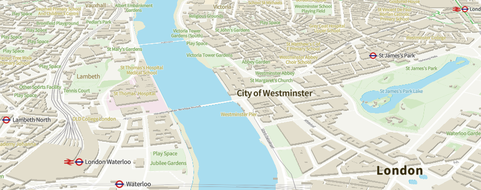

OS Vector Tile API is a vector tile service providing detailed Ordnance Survey data as a customisable basemap. It can be used with most web mapping libraries including Mapbox GL JS, Leaflet, OpenLayers and ArcGIS API for JavaScript. Vector Tiles have the benefit of being optimised for use across the internet and are great for building interactive web maps. You can zoom, pan, rotate, tilt and even extrude 3D buildings.

You have a choice between using Ordnance Survey styles or creating your own. You can customise the content and the style to create a map that perfectly meets your needs. Design a map that matches your brand or get creative and add some cartographic flair to your application.

With OS Vector Tile API you can also select and interact with the individual map features.

OS Vector Tile API is available in two projections; British National Grid for GB data and Web Mercator which is a global coordinate system.

With OS Vector Tile API,

### You can:

* Use as a basemap in GIS, web or mobile applications.
* View the whole of Great Britain in unrivalled detail.
* Seamlessly pan, zoom, pitch and tilt the map.
* Overlay your own data to give it geographic context.
* Trace over OS MasterMap Topography Layers \(Premium Data\) detailed geometries.
* Customise the map style and content to create the map you need.
* Access the maps in different projections - British National Grid and Web Mercator.

### You can't:

* Retrieve all the detailed attribution from OS data.

## What next?

For further reading on the OS Vector Tile API, refer to the [getting started guide](https://osdatahub.os.uk/docs/vts/gettingStarted), [technical specification](https://osdatahub.os.uk/docs/vts/technicalSpecification) or check out [code examples](https://labs.os.uk/public/os-data-hub-examples/os-vector-tile-api/).  

