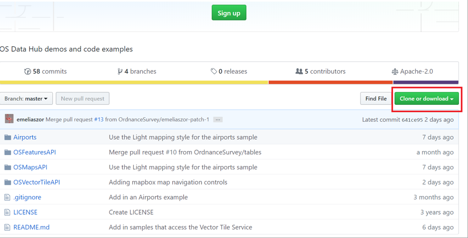
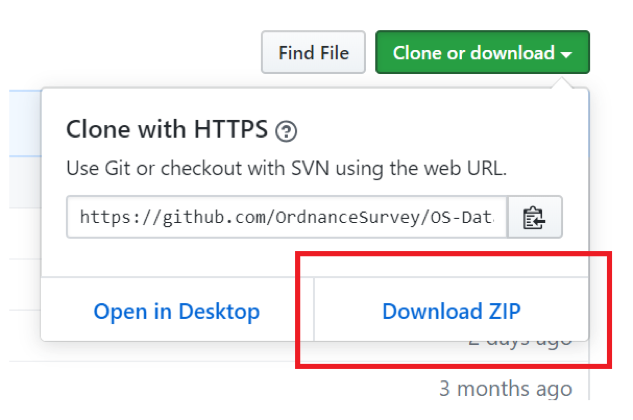
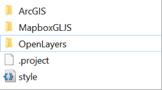
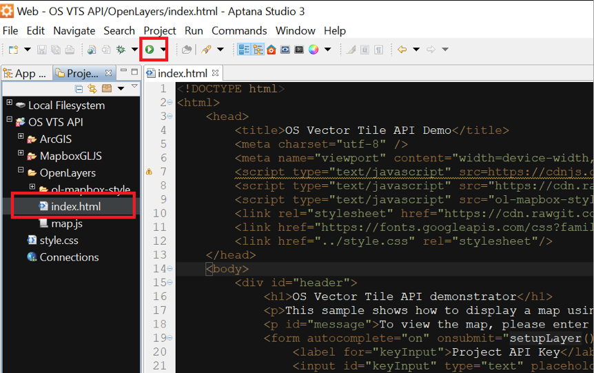
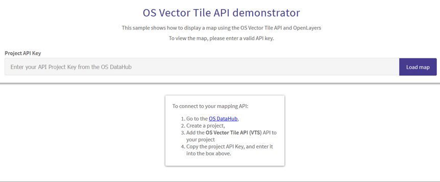
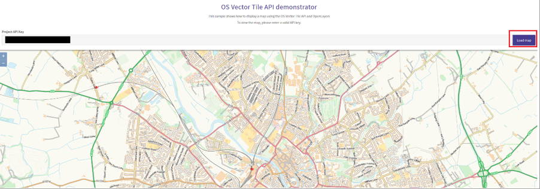

This guide explains how to generate an API key to access the OS Vector Tile API, and then how to use that API key with a Web Development IDE to create a web-based application.

This guide assumes basic knowledge of web development and will require access to an IDE \(Integrated Development Environment\).

### Instructions to Generate a Project API Key and URL

The following instructions describe how to obtain the API service URL and to generate an API key:

1. Click this link to open the [OS Data Hub](https://osdatahub.os.uk/) in a new tab.
2. Click "API Dashboard" in the main menu.
3. Click "APIs" in the left-hand menu.
4. Click "Add to API project" to the right of OS Vector Tile API.
5. If you already have a project you may choose to add the OS Vector Tile API into that project, or alternatively Select "Add to NEW PROJECT".

   The next screen will contain the Project API Key and the API Endpoint address \(API URL\).

   You can return to this screen by clicking "My projects" at any point in the future if you need to copy your API key or the API address, or if you need to regenerate your API Key.

6. Keep this page open as you'll need the key when you apply the OS Vector Tile API service in your web-based application.

For demonstrative purposes, we will apply the service through an IDE to create a web-based application.

### Instructions to create a web-based application

To do this you will require access to an IDE and to Ordnance Survey’s Github Demo repository. You will not require a Github account in order to access the demos.

Download and install the OSVectorTileAPI repository

1. Navigate to the OS Data Hub demo Github repository which can be found [here](https://github.com/OrdnanceSurvey/OS-Data-Hub-API-Demos).
2. Click the green Clone or download button.

3. Click the option to Download ZIP.

4. Navigate to your downloads page and unzip the OSVectorTileAPI folder from the newly downloaded file and place it in your IDE project repository. When you open up your IDE, the new files should appear automatically in your project window.

5. The folders you have installed contain all the coding required to call and interact with the code libraries. The method differs between IDE, however, to launch the web-based application navigate to, and open the index.html file found in the OpenLayers folder. Once you have done this, run the application.

### Using the web-based demo

1. Running the project will launch a window in your browser that looks like this:

The demo application is now running on a temporary local server from your own computer. This sever is private to your IP address and so cannot be shared with other users. This server will exist as long as your IDE is open. You will have to run the index.html file through your IDE each time you wish to use the demo.

2. To use the demo, open up your My projects page on the OS Data Hub and copy the Project API Key.

3. Paste the key into the Project API Key box on the local server demo and run Load Map.

This will then generate a fully styled map using the OS Vector Tile API service available for you to now explore. You can also use the code provided in the demo as the basis for your own web-browser application.

**Well done!** You've just completed the following actions:

1. You've obtained the URL and generated an API key for OS Vector Tile API.
2. You've accessed and downloaded the OS Vector Tile API demo from our Github repository.
3. You have created a localised demo using your IDE and have applied your API key in order to interact with the data.

### What next?

For further reading on the OS Vector Tile API, refer to the [technical specification](https://osdatahub.os.uk/docs/vts/technicalSpecification) or check out [code examples](https://labs.os.uk/public/os-data-hub-examples/os-vector-tile-api/).

